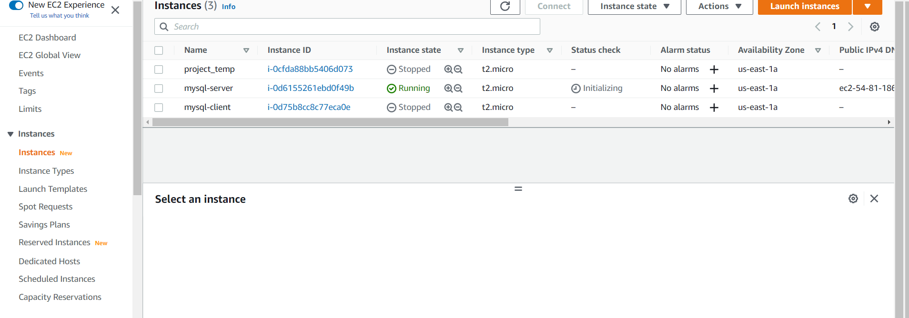
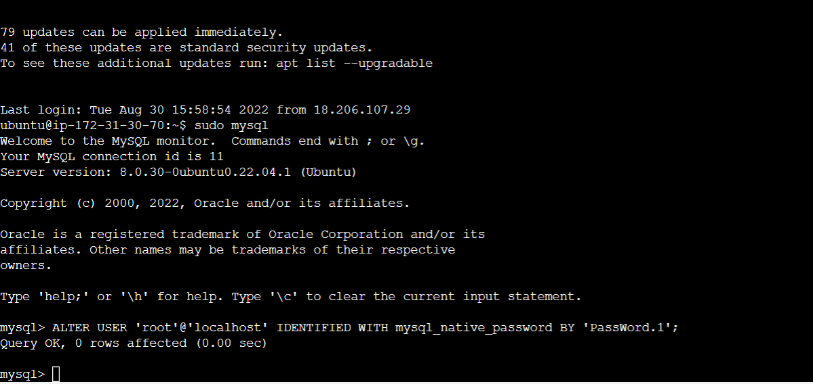
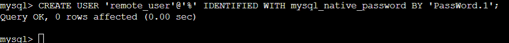
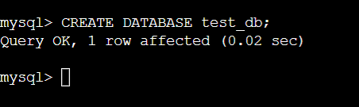
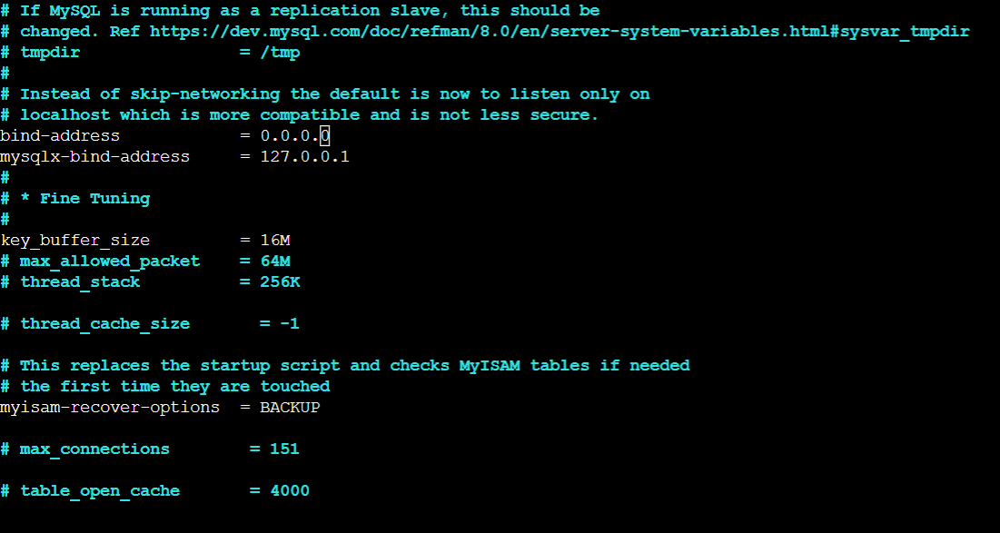
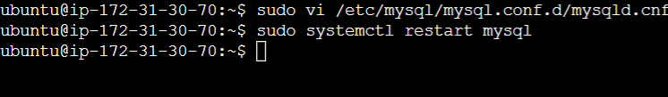
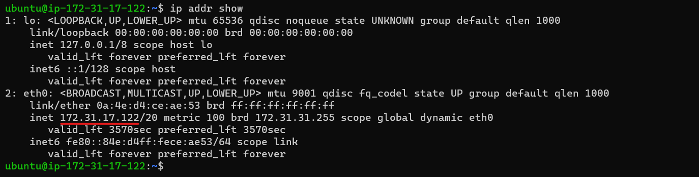
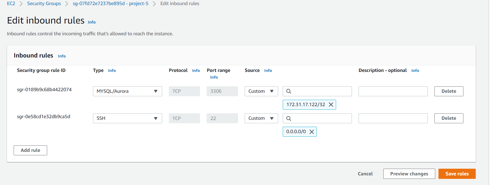
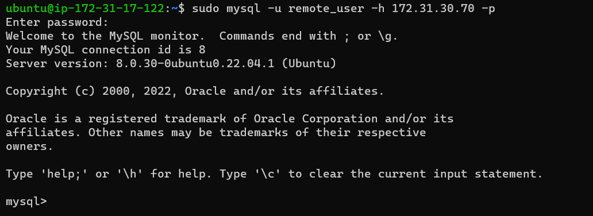
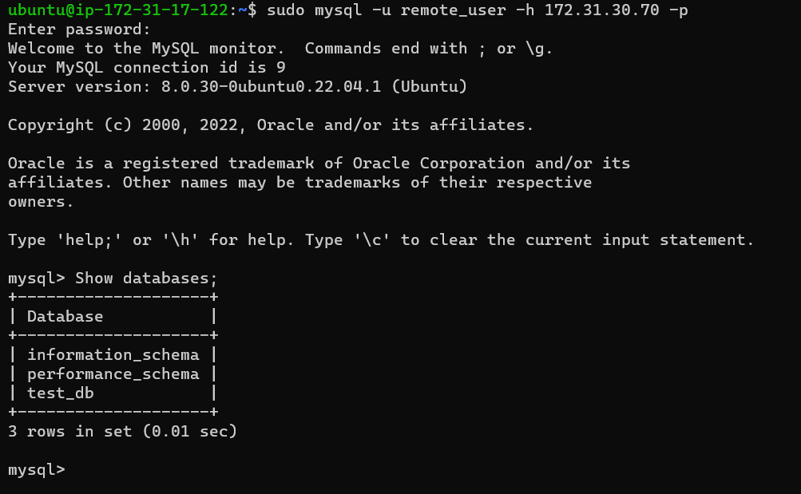

# PROJECT 5: Client/Server Architecture Using A MySQL Relational Database Management System

First create twi linux virtual servers on in AWS. One is the server and the other is the client:

## Install MYSQL-server in the server virtual instance and create database:

`sudo apt install mysql-server`

`sudo mysql`

!

`sudo mysql_secure_installation`

`sudo mysql -p`

Create user:

Create database:

Grant access to Database:

Also need to configure mysql server to allow connections from remote hosts:

`sudo vi /etc/mysql/mysql.conf.d/mysqld.cnf`

Change bind address 127.0.0.1 to 0.0.0.0

Note:

Restart mysql

## Install MYSQL-client in the client virtual instance:

`sudo apt-get install mysql-client`

Note: 

make sure to run `sudo apt-get update` before every install

Find out IP address for client:

## Edit inbound rules:

Edit the inbound rules to allow access only to the specifiv local IP address from mysql client

## Connect to Database from Client:

Connect to the database using this:

`sudo mysql -u remote_user -h 172.31.17.122 -p`

Then show the databases by running `show databases' inside of mysql

DONE